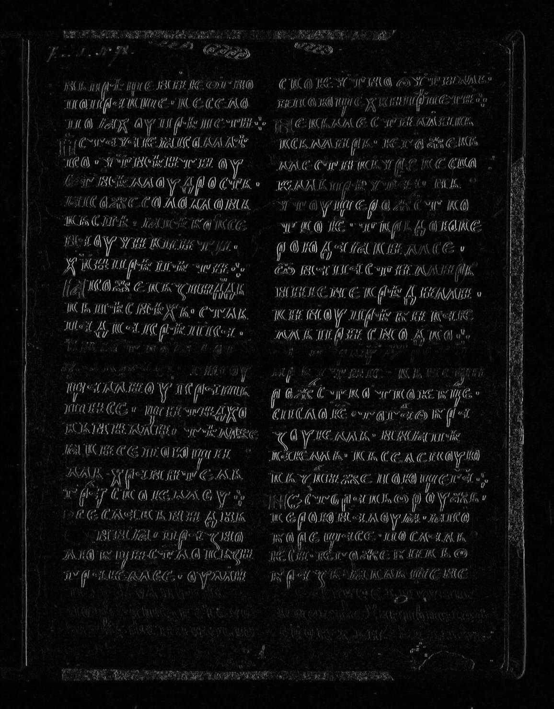
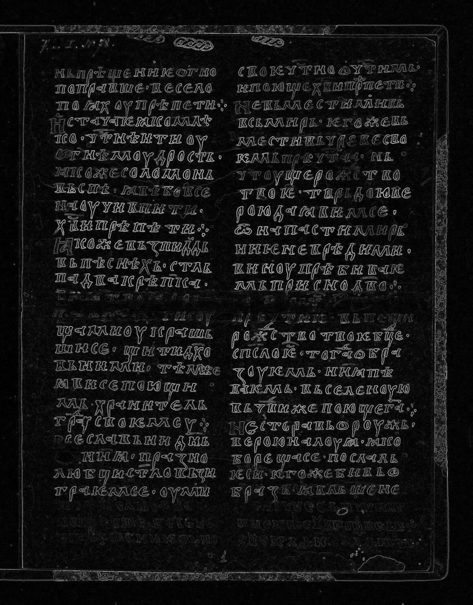
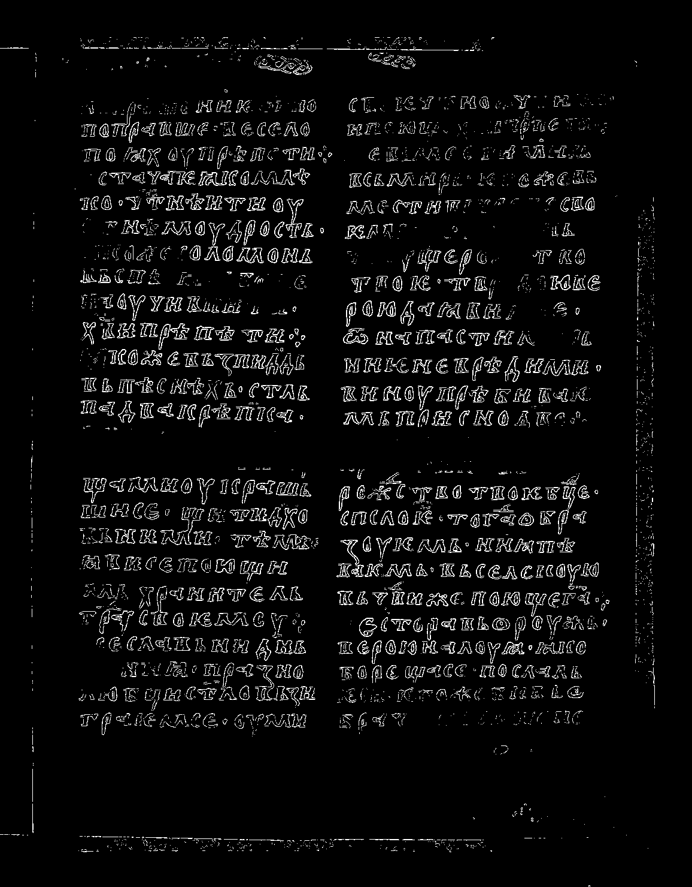

# Лабораторная работа №4  
## Выделение контуров на изображении

## Вариант 11  
Метод: оператор Круна (Kroon) 3×3  
Формула градиента:  
\[
G = \sqrt{G_x^2 + G_y^2}
\]

## Исходные данные

- Источник изображения:  
`https://www.slavcorpora.ru`
- Тип изображения: цветное (RGB)
- Размер: определяется автоматически

## Этапы выполнения

### 1. Преобразование изображения в полутоновое

### 2. Вычисление градиентов

Используются ядра оператора Круна:

### Горизонтальный градиент (Gx)

| 17 | 61 | 17 |
|----|----|----|
| 0  | 0  | 0  |
| -17 | -61 | -17 |

---

### Вертикальный градиент (Gy)

| 17 | 0  | -17 |
|----|----|-----|
| 61 | 0  | -61 |
| 17 | 0  | -17 |

### 3. Вычисление итогового градиента

### 4. Нормализация

### 5. Бинаризация

### Исходное изображение

### Полутоновое изображение

### Градиенты

| Gx | Gy | G |
|:--:|:--:|:--:|
|  |  |  |

### Бинаризация

## Вывод

В ходе лабораторной работы был реализован алгоритм выделения контуров с использованием оператора Круна.

Были получены частные производные изображения \(G_x\) и \(G_y\), итоговая градиентная матрица \(G\), а также бинаризованная карта контуров.

Метод показал хорошее качество выделения границ объектов и устойчивость к шуму по сравнению с базовыми операторами.
